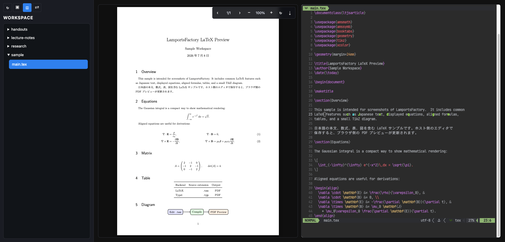

# LamportsFactory

LamportsFactory watches LaTeX / Typst files in a mounted directory and previews the generated PDF in a browser.



## Image

```text
ghcr.io/recelsus/lamportsfactory:latex-latest
ghcr.io/recelsus/lamportsfactory:typst-latest
```

## Docker Compose

Create local directories first.

```bash
mkdir -p workspace volumes/texmf volumes/fonts volumes/nvim
```

Create `docker-compose.yml`.

```yaml
services:
  lamports-factory:
    image: ghcr.io/recelsus/lamportsfactory:latex-latest
    container_name: lamports-factory
    environment:
      # path only. examples: / | /lamports-factory
      BASE_URL: /
      WORKSPACE_DIR: /app/workspace
      BUILD_DIR_NAME: build
      DOCUMENT_EXTENSION: .tex
      COMPILER_BACKEND: latex
      LATEX_BUILD_TOOL: latexmk
      LATEX_ENGINE: lualatex
      RELOAD_MODE: sse
      LAYOUT_MODE: split
      TTYD_ENABLED: enable
      # optional:
      # MAIN_DOCUMENT: sample/main.tex
      # NVIM_CONFIG_REPO: "https://github.com/yourname/nvim.git"
      # NVIM_BOOTSTRAP_ON_INIT: enable
    volumes:
      - ./workspace:/app/workspace
      - ./volumes/texmf:/app/texmf
      - ./volumes/fonts:/app/fonts
      - ./volumes/nvim:/app/nvim
    ports:
      - "8080:8080"
    restart: unless-stopped
```

```bash
docker compose up -d
```

## Typst

To use the Typst image, change the image and document settings.

```yaml
image: ghcr.io/recelsus/lamportsfactory:typst-latest
environment:
  # path only. examples: / | /lamports-factory
  BASE_URL: /
  WORKSPACE_DIR: /app/workspace
  BUILD_DIR_NAME: build
  DOCUMENT_EXTENSION: .typ
  COMPILER_BACKEND: typst
  RELOAD_MODE: sse
  LAYOUT_MODE: split
  TTYD_ENABLED: enable
  # optional:
  # MAIN_DOCUMENT: sample/main.typ
  # NVIM_CONFIG_REPO: "https://github.com/yourname/nvim.git"
  # NVIM_BOOTSTRAP_ON_INIT: enable
  # TYPST_OPTS: "--root . --font-path /app/fonts"
  ...
```

## Directory

```text
workspace/       Files to edit: .tex / .typ
volumes/texmf/   Additional LaTeX packages and local texmf files
volumes/fonts/   Additional fonts
volumes/nvim/    nvim config, plugins, and cache
```

## Config

Common environment variables:

```text
BASE_URL                 Path only. Examples: / | /lamports-factory
MAIN_DOCUMENT            Initial document. If omitted, backend default is used
DOCUMENT_EXTENSION       .tex | .typ
COMPILER_BACKEND         latex | typst
BUILD_DIR_NAME           Build directory name created beside each document
LAYOUT_MODE              preview | split
TTYD_ENABLED             enable | disable
NVIM_CONFIG_REPO         nvim config repository. If omitted, clone is skipped
NVIM_BOOTSTRAP_ON_INIT   enable | disable. Default: enable
```

LaTeX-only variables:

```text
LATEX_BUILD_TOOL         latexmk | tectonic
LATEX_ENGINE             lualatex | xelatex | pdflatex | platex | uplatex
LATEXMK_OPTS             Extra latexmk options
TECTONIC_OPTS            Extra tectonic options
```

Typst-only variables:

```text
TYPST_OPTS               Extra options passed to typst compile
```

## Third-Party Licenses

This project includes or vendors the following third-party libraries.

```text
cpp-httplib              MIT License
PDF.js                   Apache License 2.0
```

Container images also install third-party tools such as TeX Live, Typst, Neovim, ttyd, tmux, nginx, and related packages. Those tools are distributed under their respective licenses.

See [THIRD_PARTY_NOTICES.md](./THIRD_PARTY_NOTICES.md) for more details.
